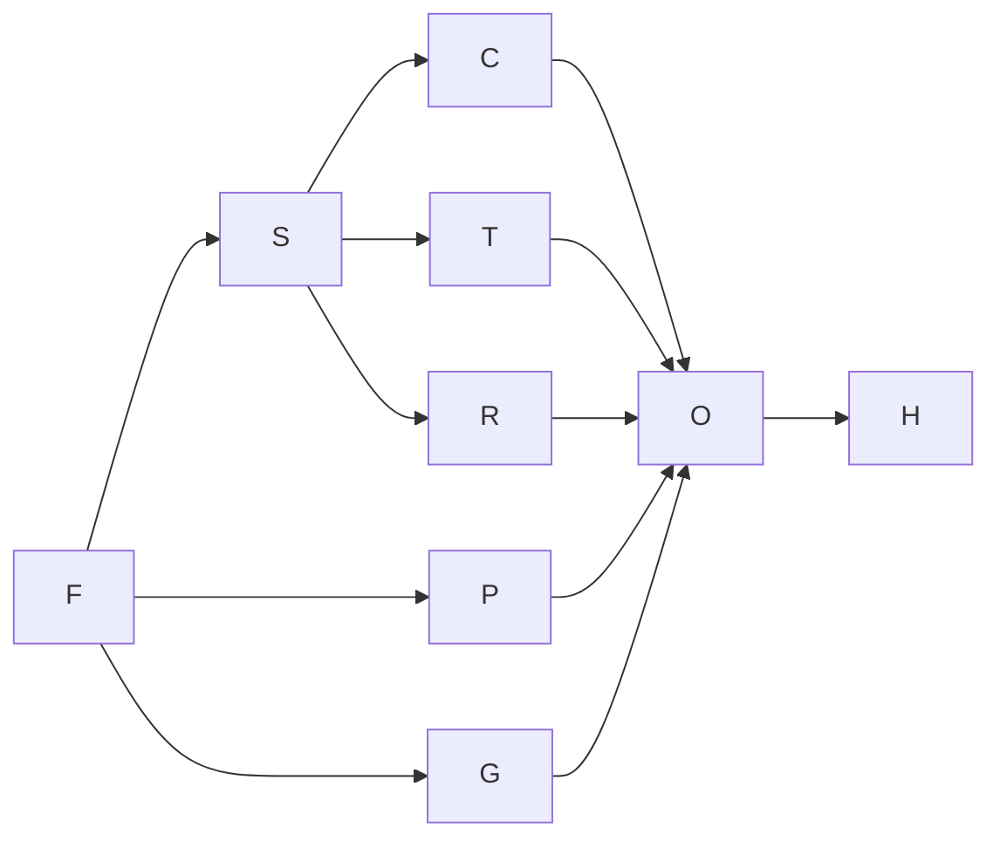

# Execution plan

## Authority and capacity

This file alone controls assignments, prerequisites, scheduling and ownership. Agent IDs are implementation units, not a request to launch agents now. Each unit is one independently reviewable outcome. Every feature test belongs to its implementation owner; H verifies combined behavior.

Available capacity: the user confirmed up to 20 concurrent subagents. This replaces the earlier three-slot assumption. Treat 20 as a ceiling, not a utilization target; the current DAG needs at most five simultaneous implementation units plus F handling integration. No budget or release deadline was supplied. The plan also works at reduced capacity. One effort-day is about eight focused engineering hours; estimates include context loading, feature testing, handoff, local integration and review, not calendar guarantees for unattended agents. External account approval or service waiting time is excluded and may dominate completion.

## Work table

“Integrated” means incorporated locally and combined checks passed. A stable contract is enough to implement an adapter against fixtures; completed runtime implementation is not needed for P or G. All package manifests remain F-owned regardless of package-directory ownership below. Code/test paths are proposed because the project has no source yet.

| Agent ID and prompt | Deliverable | Direct prerequisites and required contracts | Exclusive owned paths | Acceptance and validation | Duration and confidence | Unlocks |
|---|---|---|---|---|---|---|
| [F: foundation](agent-prompts/foundation.md) | Bootstrap and freeze working contracts, compiled CLI probe, config schema and minimal fakes | None | `Root manifests and lockfile`; `every package manifest`; `tsconfig.json`; `.gitignore`; `.tool-versions`; `schema/`; `scripts/`; `.github/`; `LICENSE`; `THIRD_PARTY_NOTICES.md`; `packages/core/`; `initial CLI entrypoint and initial packages/testing/` | V001,V002,V005; T01 | 1–2 d, medium | S, P, G |
| [S: storage](agent-prompts/storage.md) | Registry, canonical durable stores, transaction APIs and migrations | F integrated; C01–C03, C06 | `packages/storage/ except manifest` | V004,V014,V015; T02 | 2–3 d, medium | C, T, R |
| [C: local-cli](agent-prompts/local-cli.md) | Non-destructive init, registry and offline inspection/history commands | S integrated; C01,C03,C06,C07 stable | `packages/cli/src/local/`; `packages/cli/templates/`; `colocated tests` | V003,V007; T02 | 2–3 d, medium | O; fake vertical slice |
| [T: tools](agent-prompts/tools.md) | Native/MCP tools and opaque attachment lifecycle | S integrated; C02,C03,C06 stable | `packages/tools/ and packages/mcp/ except manifests`; `examples/hello/`; `examples/attachments/` | V020–V025; T04 | 2–4 d, medium | O; fake vertical slice |
| [R: runtime](agent-prompts/runtime.md) | Authorized canonical run loop, queues, context, fake vertical integration and durable outbox | S integrated; C02–C09 stable | `packages/runtime/ except manifest`; `packages/testing/ after F`; `tests/integration/` | V006,V010–V019,V044; T03 | 5–8 d, low-medium | O; fake vertical slice |
| [P: providers](agent-prompts/providers.md) | Google/Gateway and subscription OAuth adapters, credential ownership and auth CLI | F integrated; C01,C05,C06 stable; OAuth transport portion blocked pending evidence | `packages/provider-google/, packages/provider-vercel/, packages/provider-openai-chatgpt/, packages/credentials/ except manifests`; `packages/cli/src/auth/` | V026–V030; T05 | 3–6 d, low | O |
| [G: telegram](agent-prompts/telegram.md) | Telegram Gate, renderer, native drafts/stop, callbacks and retry classification | F integrated; C02,C04,C06 stable | `packages/gate-telegram/ except manifest` | V031–V036; T06 | 4–6 d, low-medium | O |
| [O: operations](agent-prompts/operations.md) | Assemble live product, operational CLI, services and documentation; verify first fake slice before live wiring | C,T,R,P,G integrated; C01–C09 stable; required product decisions resolved | `packages/cli/src/main.ts and loader after F`; `packages/cli/src/operations/`; `packages/runtime/ and tests/integration/ after R`; `docs/`; `README.md`; `tests/e2e/`; `benchmarks/` | V008,V009,V037–V042; T03,T07 | 2–4 d, medium-low | H |
| [H: hardening](agent-prompts/hardening.md) | Combined release verification and bounded integration fixes | O integrated and all prior owner handoffs accepted | `All implementation paths after all prior owners finish`; `orchestration/release-report.md` | V043 and all requirements; T08 | 2–4 d, low-medium | Verified readiness or explicit blocked report |

Acceptance IDs link through the traceability table below; T-IDs refer to [testing.md](testing.md). Owned directories include colocated tests and fixtures, excluding separately assigned subpaths. No owner may claim a directory merely because a consumer needs a change there.

## Dependency DAG and readiness

Explanatory waves: F; then S/P/G; C/T/R become ready after S; O assembles after its direct prerequisites; H after O. These are not global barriers. P/G can build against fixtures before storage/runtime. R builds against fake provider/Gate and tool-port fixtures while T builds real tools; O must validate the §67 native-tool vertical slice before live adapters. Stable C-IDs must exist in code with conformance fixtures before dependent work starts.

Start a unit only from the verified revision containing its direct prerequisites, with required contracts present, decisions affecting that unit resolved and its paths free. A blocked subpart can remain parked while unaffected work continues. O cannot declare completion with P's required OAuth path missing.

## Schedule and estimates

Start every ready, independently owned unit immediately, up to the 20-subagent ceiling. After F, start S/P/G together. Once S is integrated and verified, start C/T/R together without waiting for P or G to finish. Keep F available for shared contracts, dependency changes and serialized integration reviews. No extra reviewer or coordination agent is required. Start O and H only when their direct prerequisites are verified.

Using midpoint estimates, the revised schedule is approximately F 0–1.5; S 1.5–4, P 1.5–6, G 1.5–6.5; C 4–6.5, T 4–7, R 4–10.5; O 10.5–13.5; H 13.5–16.5 effort-days elapsed. Compared with the previous capacity assumption, C starts 2.5 effort-days sooner and T starts 2 sooner. Five implementation units can overlap, with F's integration duty bringing active roles to at most six, below the available limit.

The duration-weighted critical path remains provisionally F → S → R → O → H, 12–21 effort-days, midpoint 16.5. An all-low/midpoint/all-high ready-first simulation with capacity 20 gives 12/16.5/21 elapsed effort-days and a peak of five implementation units. The earlier three-slot plan already kept R running, so additional slots improve the side-branch completion margin without shortening this estimated critical path. Total effort remains 23–40 effort-days. These estimates include per-unit review/integration allowances but do not separately model a review backlog; F serializes integrations and gives critical-path prerequisites priority. These are scenario estimates, not statistical bounds or an AI wall-clock forecast.

Do not create 20 assignments just because 20 slots exist. Further splits considered:

- Splitting P into Google/Gateway and OAuth work could finish the API-key adapters sooner, but P is already off the estimated critical path and still shares credential contracts. Revisit only if OAuth work becomes the longest required branch.
- Splitting R into steering/session execution, authorization/context and outbox owners could shorten its coding work, but currently shares durable transition contracts, lifecycle code and concurrency fixtures. There is not yet evidence that saved time exceeds new ownership and integration costs. Retain one accountable owner; revisit after F/S establish concrete module seams, with disjoint paths and a revised estimate before dispatch.
- Starting C/T/R before S completes would require a second storage test implementation or less realistic recovery tests. Stable API definitions alone do not satisfy their current real-SQLite deliverables. Keep S as their verified prerequisite; revisit if implementation reveals a genuinely independent deliverable.

If fewer slots become available, prioritize S and then R, followed by P/G, T and C among ready units. With one slot use F,S,R,T,C,P,G,O,H. Recompute the remaining weighted path after each actual handoff. No artificial wave barriers or idle-slot reservations should delay ready work.

Resource bottlenecks are now dependencies and shared ownership rather than agent capacity: OAuth contract/access, live Telegram credentials, shared core contracts, package/lockfile edits, runtime composition and compiled arbitrary-root tool loading. F handles shared-file changes and integrations one at a time while unaffected units continue. Split a unit only when its concrete path boundaries and estimated net time saving justify the extra coordination.

## Ownership transfers and extensions

F is integration owner until H starts. Its ongoing shared-file ownership is root/package manifests, lockfile, build/type/CI configuration, schema generation, notices/licenses and core contract definitions. F alone edits orchestration planning documents when updating assignments/contracts/commands; other agents submit precise changes in handoffs. H assumes these responsibilities only after every prior owner is done.

Transfers are exclusive and recorded with source revision and acknowledgment before editing:

1. F → R: `packages/testing/` after foundation's minimal fakes and C08 are integrated. F no longer edits fakes directly.
2. F → O: CLI entrypoint/command loader after C, P and runtime command exports are ready. Before this transfer F wires necessary local/auth module exports during integration; C/P edit only their own modules.
3. R → O: `packages/runtime/` and `tests/integration/` after R's handoff is integrated and R stops editing. O may wire concrete adapters and fix lifecycle integration, without changing canonical semantics.
4. All owners → H: after O and every release-required branch are integrated. H owns necessary integration fixes everywhere, including migrations/generated files/CI, and creates evidence report. Former owners may advise but may not edit unless H records a further transfer.

S alone writes physical schemas and migrations before H. Consumers request transaction/API additions through F for core and S for SQL; no direct consumer SQL. G owns Telegram callback transport, while durable action/binding tables stay with S. P owns credential implementation in packages/credentials/ and subscription protocol in its provider package; F owns the core ports. T owns attachment bytes/execution, S its metadata schema, R its lifecycle calls. No agent independently edits a generated schema; F regenerates from the code authority. Future new paths need explicit assignment before creation.

Each owner can request an extension by naming paths, reason, affected contracts and tests. F records the change here, notifies affected agents and serializes shared-file edits. Root manifests and lockfile cannot be regenerated from concurrent branches.

## Isolation and integration procedure

No Git repository exists. Assumption: the future implementation task permits initializing Git and making an initial baseline commit locally. F verifies that permission/workflow then initializes a working baseline. Concurrent implementers use separate Git worktrees and distinct local branches based on the verified integration revision. No remote/protected-branch workflow has been established.

If Git initialization or worktrees are unavailable, use one serial working directory with ownership gates, reducing capacity to one. Do not simulate parallel ownership by copying mutable files and later overwriting them.

1. Implementer validates its branch, submits changed paths, interfaces, requirement/check IDs, exact results, unresolved issues and source revision. No secret-bearing output.
2. F incorporates ready changes using the repository's authorized workflow. Without an existing policy, use a local integration branch and reviewed local commits; no push, protected merge or deployment. This is a future procedure, not authorization from this planning task to do it now.
3. F runs combined contract/type checks and affected integration checks, records verified revision and releases downstream readiness only after success. O checks the full fake vertical slice before live integration.
4. Downstream owners start/rebase from that verified revision, never an unverified peer branch. Changes touching unfinished work require an explicit ownership transfer or owner-authored fix.

For a shared contract change, identify all consumers, have F update the authoritative code definition and this plan, notify consumers, pause incompatible work, and revalidate them before integration. Do not freeze an incorrect contract just to keep the schedule.

For failed work, record the blocker, required evidence/decision and affected dependents in this plan; keep unrelated ready units running. Transfer ownership explicitly before another agent repairs those paths. H reports release readiness separately from external-environment blocks and may not redesign product behavior to pass a check.

## Requirement traceability

Each requirement has exactly one primary accountable agent. Supporting agents contribute but do not duplicate accountability. F owns integration mechanics, not everyone else's product acceptance. H verifies preservation across the combined result; there is no existing application behavior to regression-test at this baseline.

| Requirement ID | Primary accountable agent | Supporting agents | Acceptance/test reference |
|---|---|---|---|
| V001 | F | H | [Acceptance](product/platform.md), V001; [checks](testing.md), T01 |
| V002 | F | O,H | [Acceptance](product/platform.md), V002; [checks](testing.md), T01 |
| V003 | C | S,O | [Acceptance](product/platform.md), V003; [checks](testing.md), T02 |
| V004 | S | C | [Acceptance](product/platform.md), V004; [checks](testing.md), T02 |
| V005 | F | S,R,O | [Acceptance](product/platform.md), V005; [checks](testing.md), T01,T02 |
| V006 | R | G | [Acceptance](product/platform.md), V006; [checks](testing.md), T03 |
| V007 | C | S,T,P,O | [Acceptance](product/platform.md), V007; [checks](testing.md), T02,T07 |
| V008 | O | R,P,T | [Acceptance](product/platform.md), V008; [checks](testing.md), T03,T07 |
| V009 | O | C,F,H | [Acceptance](product/platform.md), V009; [checks](testing.md), T07 |
| V010 | R | S,G | [Acceptance](product/identity-history.md), V010; [checks](testing.md), T03 |
| V011 | R | S,G,O | [Acceptance](product/identity-history.md), V011; [checks](testing.md), T03 |
| V012 | R | S | [Acceptance](product/identity-history.md), V012; [checks](testing.md), T03 |
| V013 | R | S,T | [Acceptance](product/identity-history.md), V013; [checks](testing.md), T03 |
| V014 | S | R,T,P,G | [Acceptance](product/identity-history.md), V014; [checks](testing.md), T02,T03 |
| V015 | S | R,H | [Acceptance](product/identity-history.md), V015; [checks](testing.md), T02 |
| V016 | R | P | [Acceptance](product/identity-history.md), V016; [checks](testing.md), T03 |
| V017 | R | T,P,G | [Acceptance](product/identity-history.md), V017; [checks](testing.md), T03 |
| V018 | R | S,G,O | [Acceptance](product/identity-history.md), V018; [checks](testing.md), T03,T06 |
| V019 | R | S,G,O | [Acceptance](product/identity-history.md), V019; [checks](testing.md), T03 |
| V020 | T | F,R | [Acceptance](product/tools-attachments.md), V020; [checks](testing.md), T04 |
| V021 | T | R,O | [Acceptance](product/tools-attachments.md), V021; [checks](testing.md), T04,T07 |
| V022 | T | R | [Acceptance](product/tools-attachments.md), V022; [checks](testing.md), T04 |
| V023 | T | S | [Acceptance](product/tools-attachments.md), V023; [checks](testing.md), T04 |
| V024 | T | G,P,R | [Acceptance](product/tools-attachments.md), V024; [checks](testing.md), T04,T06 |
| V025 | T | S,O | [Acceptance](product/tools-attachments.md), V025; [checks](testing.md), T04,T07 |
| V026 | P | R | [Acceptance](product/providers.md), V026; [checks](testing.md), T05 |
| V027 | P | F,H | [Acceptance](product/providers.md), V027; [checks](testing.md), T05 |
| V028 | P | F,O | [Acceptance](product/providers.md), V028; [checks](testing.md), T05 |
| V029 | P | C,R,T,G,O | [Acceptance](product/providers.md), V029; [checks](testing.md), T05,T07 |
| V030 | P | R | [Acceptance](product/providers.md), V030; [checks](testing.md), T05 |
| V031 | G | R | [Acceptance](product/telegram.md), V031; [checks](testing.md), T06 |
| V032 | G | R | [Acceptance](product/telegram.md), V032; [checks](testing.md), T06 |
| V033 | G | R | [Acceptance](product/telegram.md), V033; [checks](testing.md), T06 |
| V034 | G | S,R | [Acceptance](product/telegram.md), V034; [checks](testing.md), T06 |
| V035 | G | R | [Acceptance](product/telegram.md), V035; [checks](testing.md), T06 |
| V036 | G | R,S | [Acceptance](product/telegram.md), V036; [checks](testing.md), T06 |
| V037 | O | F,R,S | [Acceptance](product/operations.md), V037; [checks](testing.md), T07 |
| V038 | O | R,T,P,G | [Acceptance](product/operations.md), V038; [checks](testing.md), T07 |
| V039 | O | F,H | [Acceptance](product/operations.md), V039; [checks](testing.md), T07 |
| V040 | O | R,P,G | [Acceptance](product/operations.md), V040; [checks](testing.md), T07 |
| V041 | O | R,G,H | [Acceptance](product/operations.md), V041; [checks](testing.md), T07 |
| V042 | O | F,T,H | [Acceptance](product/operations.md), V042; [checks](testing.md), T01,T07 |
| V043 | H | F,S,C,T,R,P,G,O | [Acceptance](product/operations.md), V043; [checks](testing.md), T08 |
| V044 | R | F,S,P,C,G,O,H | [Acceptance](product/identity-history.md), V044; [checks](testing.md), T03 |

## Current blockers and readiness

All units are unstarted. F has no application prerequisite. P's subscription transport is blocked on the evidence described in product/providers.md; live release checks also await authorized services/accounts and environment. The user resolved delivery ambiguity, group controls, default steering and reset ordering in product/identity-history.md. C09 SDK continuation compatibility must be proven by F/R; no behavior question remains pending. These do not block foundation, storage, offline adapters or unaffected runtime behavior. No estimate includes waiting for external authorization or unknown API support.
